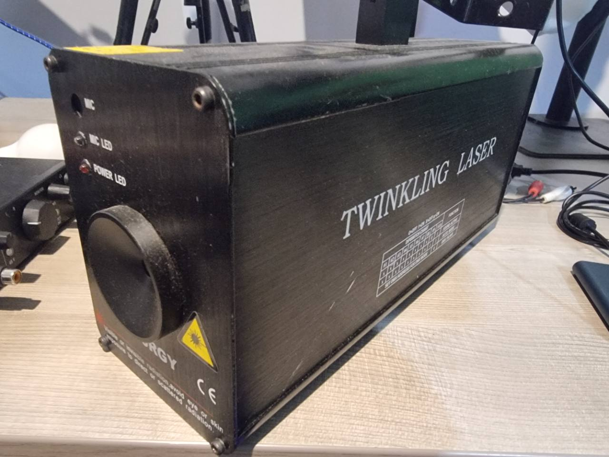

# AB-FIX-001: Twinkling Laser Series RGY

## Identification

- Manufacturer: Generic / not marked
- Product family: Laser Show System, Twinkling Laser Series
- Marking on fixture: `TWINKLING LASER`, `RGY`
- Probable model: `TL-2028`
- Model confidence: Probable, not confirmed from the photographed enclosure
- Category: Laser / Twinkling and starfield effect
- ArtBastard profile ID: `laser-twinkler`
- DMX footprint: 5 channels

The manual says channel 5 is available only for the TL-2028. The photographed
fixture is an RGY unit and matches the documented colour channel, but no model
label is visible. The profile therefore retains channel 5 and records the model
as probable.

## DMX Mode

### 5-channel mode

| Channel | ArtBastard role | Function | DMX values |
| --- | --- | --- | --- |
| 1 | Macro | Laser power and operating mode | 0-49 off; 50-99 DMX; 100-149 sound-active; 150-255 automatic |
| 2 | Effect | Rotation direction | 0-99 clockwise; 100-199 stopped; 200-255 counter-clockwise |
| 3 | Speed | Rotation speed | 0 fastest through 255 slowest |
| 4 | Speed | Twinkle speed | 0 fastest through 255 slowest |
| 5 | Colour wheel | RGY colour selection | 0-99 red and green; 100-199 red; 200-255 green |

Channels 2-4 are valid only while channel 1 is in DMX mode. Channel 2 describes
rotation of the projected effect, not physical pan, so its shared role is
`effect`.

## DIP-Switch Addressing

Switches 1-9 encode the DMX start address as a binary sum:

| Switch | 1 | 2 | 3 | 4 | 5 | 6 | 7 | 8 | 9 |
| --- | --- | --- | --- | --- | --- | --- | --- | --- | --- |
| Value | 1 | 2 | 4 | 8 | 16 | 32 | 64 | 128 | 256 |

Supported start addresses are 1-511.

| Operating mode | DIP 9 | DIP 10 |
| --- | --- | --- |
| DMX or slave | Either | Off |
| Sound-active master | Off | On |
| Automatic master | On | On |

## Capabilities

- Red and green laser output, including simultaneous red and green
- Clockwise and counter-clockwise effect rotation
- Variable effect rotation speed
- Variable twinkle speed
- DMX, automatic, sound-active and master/slave operation
- No pan, tilt, gobo, focus, zoom, prism or conventional dimmer channels

## Source Notes

Transcribed from user-supplied photographs of the fixture and its printed
manual on 6 June 2026. Manual wording was normalized for spelling and clarity;
DMX boundaries were preserved exactly.

