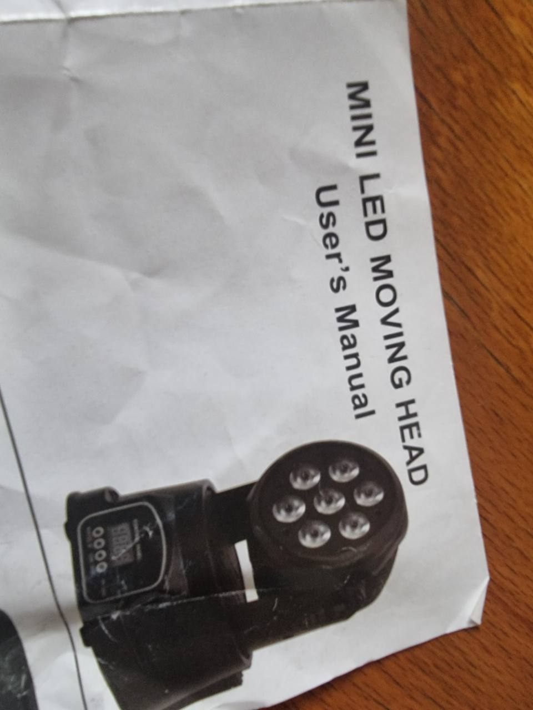

# AB-FIX-003: Mini LED Moving Head Wash

## Identification

- Type: Moving head LED wash
- Category: Moving head / LED wash
- Manufacturer: Generic
- Model: Mini LED Moving Head
- ArtBastard profile ID: `mini-led-moving-head-wash`

## Modes

### 14-channel mode

| CH | Name | DMX values | English function |
| --- | --- | --- | --- |
| 1 | Pan | 0-255 | X-axis pan |
| 2 | Pan fine | 0-255 | Fine X-axis trim |
| 3 | Tilt | 0-255 | Y-axis tilt |
| 4 | Tilt fine | 0-255 | Fine Y-axis trim |
| 5 | Pan/tilt speed | 0-255 | XY movement speed |
| 6 | Master dimmer and shutter | 0-7 / 8-134 / 135-239 / 240-255 | Off / master dimmer / strobe slow-to-fast / open |
| 7-10 | RGBW dimmers | 0-255 | Red, green, blue, white dimmers |
| 11 | Colour macro | 0-7 / 8-231 / 232-255 | Manual mix / built-in macros / colour jump |
| 12 | Colour jump speed | 0-255 | Colour jump speed |
| 13 | Program mode | 0-7 / 8-63 / 64-127 / 128-191 / 192-255 | Manual / fast auto / slow auto / sound 1 / sound 2 |
| 14 | Reset | 150-200 | Reset; other values undocumented |

### 9-channel mode

| CH | Name | DMX values | English function |
| --- | --- | --- | --- |
| 1 | Pan | 0-255 | X-axis pan |
| 2 | Tilt | 0-255 | Y-axis tilt |
| 3 | Master dimmer and shutter | 0-7 / 8-134 / 135-239 / 240-255 | Off / master dimmer / strobe slow-to-fast / open |
| 4-7 | RGBW dimmers | 0-255 | Red, green, blue, white dimmers |
| 8 | Pan/tilt speed | 0-255 | XY movement speed |
| 9 | Reset | 150-200 | Reset; other values undocumented |

## Source Notes

The supplied page is bilingual Chinese/English. This document translates the channel labels into plain English and keeps reset ranges conservative.

