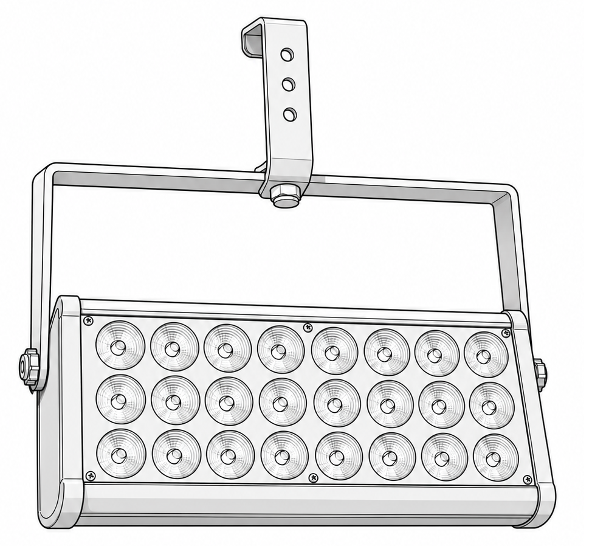

# AB-FIX-013: 24-LED Bar Wash

## Identification

- Type: Static LED bar wash (no pan/tilt)
- Category: LED bar / wall washer
- Manufacturer: Generic
- ArtBastard profile ID: `led-bar-wash-24` *(provisional)*
- LED count: 24 (8 columns x 3 rows)
- Source confidence: Photo + line-art supplied; printed manual not yet imported

## DMX Mode

Authoritative channel map lives in the library entry: `DOCS/fixtures/library/led-bar-wash-24.md`.

### 7-channel mode (provisional)

| CH | Name   | DMX values | English function           |
|----|--------|------------|----------------------------|
| 1  | Dimmer | 0-255      | 0-100% master dimmer       |
| 2  | Red    | 0-255      | 0-100% red                 |
| 3  | Green  | 0-255      | 0-100% green               |
| 4  | Blue   | 0-255      | 0-100% blue                |
| 5  | White  | 0-255      | 0-100% white               |
| 6  | Strobe | 0-255      | 0=open, ramp slow to fast  |
| 7  | Macro  | 0-255      | Built-in colour / chase    |

This is a generic RGBW-bar convention applied because the printed manual hasn't been imported yet. When the manual is in hand, update both this file and `library/led-bar-wash-24.md`.

## Notes

- Photo source: user-supplied (`Generative/X/LEDBar.png`).
- Provisional profile chosen so the fixture can be patched and lit; once the manual is verified, refine channel order/macros.
