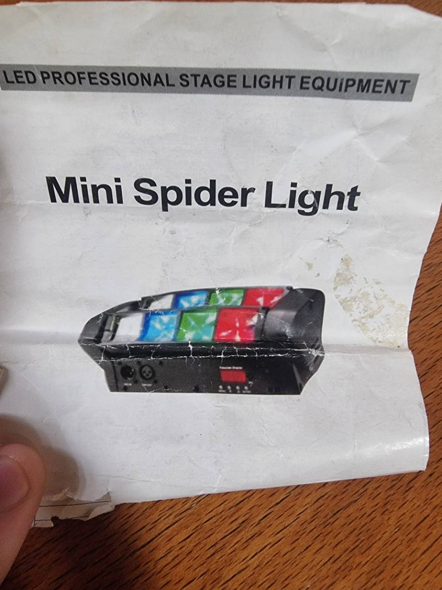

# AB-FIX-008: Mini Spider Light

## Identification

- Type: Mini spider / derby LED effect
- Category: LED effect / Mini spider derby
- Manufacturer: Generic
- Model: Mini Spider Light
- ArtBastard profile ID: `mini-spider-light`
- Source confidence: Torn manual; visible channel ranges preserved

## 15-Channel DMX Mode

| Ch | Function | Values | Description |
| --- | --- | --- | --- |
| 1 | Motor 1 Route | 0-255 | Motor 1 route / position |
| 2 | Motor 2 Route | 0-255 | Motor 2 route / position |
| 3 | Master Dimmer | 0-255 | 0-100% master dimmer |
| 4 | Strobe | 0-9 / 10-255 | No strobe / strobe speed slow to fast |
| 5 | LED 1 Dimmer | 0-255 | Red LED dimmer |
| 6 | LED 2 Dimmer | 0-255 | Red LED dimmer |
| 7 | LED 3 Dimmer | 0-255 | Green LED dimmer |
| 8 | LED 4 Dimmer | 0-255 | Green LED dimmer |
| 9 | LED 5 Dimmer | 0-255 | Green LED dimmer |
| 10 | LED 6 Dimmer | 0-255 | Blue LED dimmer |
| 11 | LED 7 Dimmer | 0-255 | Blue LED dimmer |
| 12 | LED 8 Dimmer | 0-255 | Blue LED dimmer |
| 13 | Macro Function | See macro table | Effect macro selection |
| 14 | Effect Speed | 0-255 | Effect speed |
| 15 | Reset / Utility | 0-255 | Torn manual utility channel |

## 7-Channel DMX Mode

| Ch | Function | Values | Description |
| --- | --- | --- | --- |
| 1 | Motor 1 Route | 0-255 | Motor 1 route / position |
| 2 | Motor 2 Route | 0-255 | Motor 2 route / position |
| 3 | Sun / LED Dimmer | 0-255 | LED dimmer |
| 4 | Strobe | 0-9 / 10-255 | No strobe / strobe speed slow to fast |
| 5 | Macro Function | See macro table | Effect macro selection |
| 6 | Effect Speed | 0-255 | Effect speed |
| 7 | Reset / Utility | 0-255 | Torn manual utility channel |

## Macro Function Detail

| Values | Function |
| --- | --- |
| 0-7 | No effect |
| 8-27 | Effect 1 |
| 28-37 | Effect 2 |
| 38-47 | Effect 3 |
| 48-67 | Effect 4 |
| 68-87 | Effect 5 |
| 88-107 | Effect 6 |
| 108-127 | Effect 7 |
| 128-137 | Effect 8 |
| 138-147 | Effect 9 |
| 148-157 | Effect 10 |
| 158-167 | Effect 11 |
| 168-177 | Effect 12 |
| 178-187 | Effect 13 |
| 188-207 | Effect 14 |
| 208-227 | Effect 15 |
| 228-255 | Effect 16+ / torn manual range |

## Menu Notes

The manual lists DMX address `A001-A512`, 7/15-channel mode, auto mode,
sound mode, slave mode, sound sensitivity, effect selection `SH1-SH24`,
display reverse, LED backlight, motor direction and reset.

## Capabilities

- Two motor route channels for the spider sweeps
- RGB LED bank dimming in 15-channel mode
- Shared LED dimmer in 7-channel mode
- Strobe, macro effects, effect speed and reset/utility
- Sound, slave and local auto menu modes

## Source Notes

The manual page is torn. ArtBastard maps the visible effect ranges and keeps
torn utility channels conservative.
