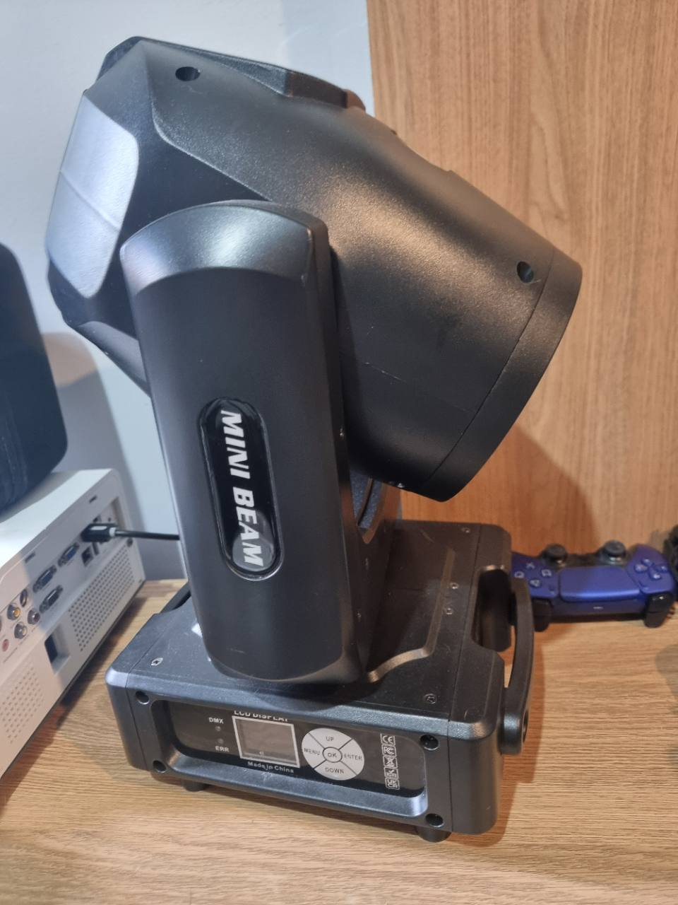

# AB-FIX-002: MiniBeam Moving Head Spot

## Identification

- Manufacturer: Generic / not marked
- Product marking: `MINI BEAM`
- Model: `MiniBeam`
- Model confidence: Confirmed from fixture body marking
- Category: Moving head / Beam spot with gobos
- ArtBastard profile ID: `minibeam-moving-head`
- DMX footprint: 18 channels

The fixture is a larger moving-head beam/spot unit with colour wheel, gobo
wheel, prism, frost, focus and pan/tilt movement. The photographed front panel
uses an LCD/menu control surface rather than the DIP-switch addressing shown on
the Twinkling Laser, so no DIP-switch map is attached to this profile.

## DMX Mode

### 18-channel mode

| Channel | ArtBastard role | Function | DMX values |
| --- | --- | --- | --- |
| 1 | Colour wheel | Colour wheel and colour rotation | 0-3 white; 4-127 split/solid colours 1-14; 128-191 rotate forward fast to slow; 192-255 rotate reverse slow to fast |
| 2 | Strobe | Shutter and strobe | 0-3 dark; 4-103 pulse strobe slow to fast; 104-107 open; 108-207 pulse strobe slow to fast; 208-212 open; 213-251 random strobe slow to fast; 252-255 open |
| 3 | Dimmer | Master dimmer | 0-255 = 0-100% |
| 4 | Gobo | Gobo wheel and gobo rotation | 0-7 open; 8-127 gobos 1-14; 128-191 reverse rotation fast to slow; 192-255 forward rotation slow to fast |
| 5 | Prism | Prism insert | 0-127 none; 128-255 insert prism |
| 6 | Prism rotation | Prism angle and rotation | 0-127 indexed prism angle, manual notes 5-60 degrees; 128-190 rotate forward fast to slow; 191-192 stop; 193-255 rotate reverse slow to fast |
| 7 | Effect | Colourful effect insert | 0-127 none; 128-255 insert colourful effect |
| 8 | Frost | Frost insert | 0-127 none; 128-255 insert frost |
| 9 | Focus | Lens focus | 0-255 far to near |
| 10 | Pan | Coarse pan | 0-255 = 0-540 degrees |
| 11 | Pan fine | Fine pan | 0-255 = 0-2 degrees |
| 12 | Tilt | Coarse tilt | 0-255 = 0-270 degrees |
| 13 | Tilt fine | Fine tilt | 0-255 = 0-1 degree |
| 14 | Macro | Macro function | Manual table lists 0-255; note says 0-14 no function and 15-255 one effect per five-value interval |
| 15 | Reset | Reset commands | 0-25 none; 26-76 reset effect motor over 3 seconds; 77-127 reset pan/tilt motor over 3 seconds; 128-255 reset fixture over 3 seconds |
| 16 | Lamp | Lamp control | 0-25 none; 26-100 turn lamp off over 3 seconds; 101-255 turn lamp on over 3 seconds |
| 17 | Speed | Pan/tilt movement speed | 0-255 fast to slow |
| 18 | Speed | Colour/effect speed | 0-255, manual gives range but no further function text |

## Colour Wheel Detail

Channel 1 uses narrow colour slots and split-colour slots:

| DMX values | Function |
| --- | --- |
| 0-3 | White |
| 4-8 | White plus colour 1 |
| 9-12 | Colour 1 |
| 13-17 | Colour 1 plus colour 2 |
| 18-21 | Colour 2 |
| 22-26 | Colour 2 plus colour 3 |
| 27-31 | Colour 3 |
| 32-35 | Colour 3 plus colour 4 |
| 36-40 | Colour 4 |
| 41-44 | Colour 4 plus colour 5 |
| 45-49 | Colour 5 |
| 50-53 | Colour 5 plus colour 6 |
| 54-58 | Colour 6 |
| 59-63 | Colour 6 plus colour 7 |
| 64-67 | Colour 7 |
| 68-72 | Colour 7 plus colour 8 |
| 73-76 | Colour 8 |
| 77-81 | Colour 8 plus colour 9 |
| 82-85 | Colour 9 |
| 86-90 | Colour 9 plus colour 10 |
| 91-95 | Colour 10 |
| 96-99 | Colour 10 plus colour 11 |
| 100-104 | Colour 11 |
| 105-108 | Colour 11 plus colour 12 |
| 109-113 | Colour 12 |
| 114-117 | Colour 12 plus colour 13 |
| 118-122 | Colour 13 |
| 123-127 | Colour 13 plus colour 14 |
| 128-191 | Colour wheel rotate forward, fast to slow |
| 192-255 | Colour wheel rotate reverse, slow to fast |

## Gobo Wheel Detail

| DMX values | Function |
| --- | --- |
| 0-7 | White / open |
| 8-16 | Gobo 1 |
| 17-24 | Gobo 2 |
| 25-33 | Gobo 3 |
| 34-41 | Gobo 4 |
| 42-50 | Gobo 5 |
| 51-58 | Gobo 6 |
| 59-67 | Gobo 7 |
| 68-75 | Gobo 8 |
| 76-84 | Gobo 9 |
| 85-92 | Gobo 10 |
| 93-101 | Gobo 11 |
| 102-109 | Gobo 12 |
| 110-118 | Gobo 13 |
| 119-127 | Gobo 14 |
| 128-191 | Gobo wheel rotate reverse, fast to slow |
| 192-255 | Gobo wheel rotate forward, slow to fast |

## Capabilities

- 540-degree pan with fine pan control
- 270-degree tilt with fine tilt control
- Colour wheel with split-colour positions and rotation
- Gobo wheel with fourteen gobo slots and rotation
- Prism insertion and prism rotation
- Frost and colourful effect insertion
- Focus from far to near
- Dimmer, strobe and random strobe
- Reset and lamp command channels

## Source Notes

Transcribed from user-supplied photographs of the fixture and printed manual on
6 June 2026. Manual wording was normalized for spelling and clarity; DMX
boundaries were preserved where legible. The printed note below the channel
table appears to refer to macro/effect intervals but labels the channel
unclearly in the photo, so the profile keeps the macro channel broad and records
the ambiguity here.
