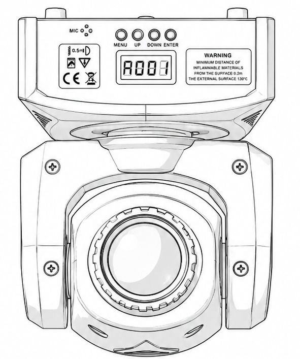

# AB-FIX-005: Small Moving Head Spot

## Identification

- Type: Small moving-head spot
- Category: Moving head / Small spot with colour and gobos
- Manufacturer: Generic
- ArtBastard profile ID: `small-moving-head-spot`
- Photo: none supplied
- Source confidence: Partial manual, broken English, no fixture photo supplied

## Modes

- 9-channel mode: coarse pan/tilt with colour wheel, gobo wheel, strobe,
  dimmer, pan/tilt speed, movement macro and dim/reset mode.
- 11-channel mode: adds pan fine and tilt fine before the same
  colour/gobo/shutter controls.

## 9-Channel DMX Mode

| Ch | Function | Values | Description |
| --- | --- | --- | --- |
| 1 | Pan | 0-255 | Pan movement |
| 2 | Tilt | 0-255 | Tilt movement |
| 3 | Colour Wheel | See colour wheel table | Colour slots, half-colours and wheel rotation |
| 4 | Gobo Wheel | See gobo wheel table | Gobo slots, jitter and wheel rotation |
| 5 | Strobe | See strobe table | Shutter, strobe and pulse effects |
| 6 | Dimmer | 0-255 | 0-100% dimmer |
| 7 | Pan/Tilt Speed | 0-255 | Fast to slow |
| 8 | Movement Macro | 0-69 / 70-119 / 120-249 / 250-255 | Movement and sound programs |
| 9 | Dim Mode / Reset | 0-20 / 21-40 / 41-60 / 61-80 / 81-100 / 101-255 | Dim curves and reset |

## 11-Channel DMX Mode

| Ch | Function | Values | Description |
| --- | --- | --- | --- |
| 1 | Pan | 0-255 | Pan movement |
| 2 | Pan Fine | 0-255 | Fine pan trim |
| 3 | Tilt | 0-255 | Tilt movement |
| 4 | Tilt Fine | 0-255 | Fine tilt trim |
| 5 | Colour Wheel | See colour wheel table | Colour slots, half-colours and wheel rotation |
| 6 | Gobo Wheel | See gobo wheel table | Gobo slots, jitter and wheel rotation |
| 7 | Strobe | See strobe table | Shutter, strobe and pulse effects |
| 8 | Dimmer | 0-255 | 0-100% dimmer |
| 9 | Pan/Tilt Speed | 0-255 | Fast to slow |
| 10 | Movement Macro | 0-69 / 70-119 / 120-249 / 250-255 | Movement and sound programs |
| 11 | Dim Mode / Reset | 0-20 / 21-40 / 41-60 / 61-80 / 81-100 / 101-255 | Dim curves and reset |

## Colour Wheel Detail

| Values | Function |
| --- | --- |
| 0-7 | Colour 1 |
| 8-14 | Colour 2 |
| 15-21 | Colour 3 |
| 22-28 | Colour 4 |
| 29-35 | Colour 5 |
| 36-42 | Colour 6 |
| 43-49 | Colour 7 |
| 50-56 | Colour 8 |
| 57-127 | Half-colour positions |
| 128-189 | Colour wheel rotate fast to slow, then stop |
| 190-193 | Fast colour rotation |
| 194-255 | Colour wheel rotate slow to fast |

## Gobo Wheel Detail

| Values | Function |
| --- | --- |
| 0-7 | Gobo 1 |
| 8-15 | Gobo 2 |
| 16-23 | Gobo 3 |
| 24-31 | Gobo 4 |
| 32-39 | Gobo 5 |
| 40-47 | Gobo 6 |
| 48-55 | Gobo 7 |
| 56-63 | Gobo 8 |
| 64-71 | Gobo 1 jitter |
| 72-79 | Gobo 2 jitter |
| 80-87 | Gobo 3 jitter |
| 88-95 | Gobo 4 jitter |
| 96-103 | Gobo 5 jitter |
| 104-111 | Gobo 6 jitter |
| 112-119 | Gobo 7 jitter |
| 120-127 | Gobo 8 jitter |
| 128-189 | Gobo wheel rotate fast to slow, then stop |
| 190-193 | Fast gobo rotation |
| 194-255 | Gobo wheel rotate slow to fast |

## Strobe Detail

| Values | Function |
| --- | --- |
| 0-7 | On |
| 8-15 | Off |
| 16-131 | Strobe, slow to fast |
| 132-139 | Off |
| 140-181 | Fast-on / slow-off pulse |
| 182-189 | Off |
| 190-231 | Fast-off / slow-on pulse |
| 232-239 | Off |
| 240-247 | Dimming effect |
| 248-255 | Off |

## Macro And Reset Detail

| Channel | Values | Function |
| --- | --- | --- |
| Movement Macro | 0-69 | Pan/tilt movement with lamp on |
| Movement Macro | 70-119 | Pan/tilt and colour/gobo movement programs |
| Movement Macro | 120-249 | Gobo and colour movement programs |
| Movement Macro | 250-255 | Sound effect show |
| Dim Mode / Reset | 0-20 | Standard dim mode |
| Dim Mode / Reset | 21-40 | Stage dim mode |
| Dim Mode / Reset | 41-60 | TV dim mode |
| Dim Mode / Reset | 61-80 | Building dim mode |
| Dim Mode / Reset | 81-100 | Theatre dim mode |
| Dim Mode / Reset | 101-255 | Reset |

## Capabilities

- Coarse and fine pan/tilt in 11-channel mode
- Colour wheel with half-colour and rotation ranges
- Gobo wheel with jitter and rotation ranges
- Strobe, pulse, dimmer and dim curve/reset modes
- Movement macro and sound-effect show range

## Source Notes

The supplied manual photos are incomplete and use broken English. ArtBastard
preserves the reliable channel counts and major ranges while marking macro rows
as partial-source behaviour.
