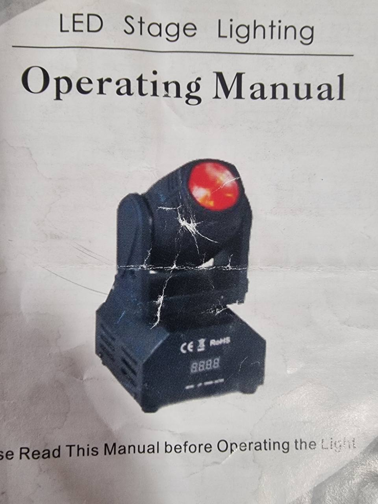
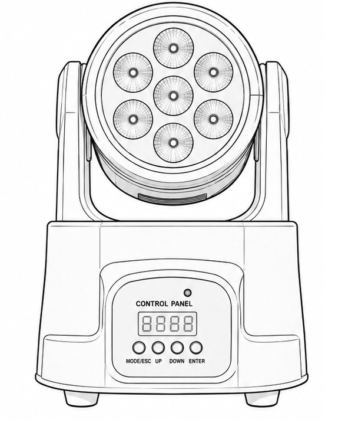

# AB-FIX-007: Tiny LED Moving Head Wash

## Identification

- Type: Toy-size LED moving-head wash
- Category: Moving head / Toy LED wash
- Manufacturer: Generic
- Model label: LED Stage Lighting
- ArtBastard profile ID: `tiny-led-moving-head-wash`
- Source confidence: Printed manual with 11-channel and 13-channel tables

## 13-Channel DMX Mode

| Ch | Function | Values | Description |
| --- | --- | --- | --- |
| 1 | Pan | 0-255 | Pan movement |
| 2 | Pan Fine | 0-255 | Fine pan trim |
| 3 | Tilt | 0-255 | Tilt movement |
| 4 | Tilt Fine | 0-255 | Fine tilt trim |
| 5 | Movement Speed | 0-255 | Pan/tilt speed |
| 6 | Master Dimmer | 0-255 | Master dimmer |
| 7 | Strobe | 0-255 | Strobe |
| 8 | Red Dimmer | 0-255 | Red LED dimmer |
| 9 | Green Dimmer | 0-255 | Green LED dimmer |
| 10 | Blue Dimmer | 0-255 | Blue LED dimmer |
| 11 | White Dimmer | 0-255 | White LED dimmer |
| 12 | Self-propelled Program | 0-255 | Automatic/self-propelled program |
| 13 | Reset | 0-149 / 150-250 / 251-255 | No action, reset, no action |

## 11-Channel DMX Mode

| Ch | Function | Values | Description |
| --- | --- | --- | --- |
| 1 | Pan | 0-255 | Pan movement |
| 2 | Pan Fine | 0-255 | Fine pan trim |
| 3 | Tilt | 0-255 | Tilt movement |
| 4 | Tilt Fine | 0-255 | Fine tilt trim |
| 5 | Movement Speed | 0-255 | Pan/tilt speed |
| 6 | Master Dimmer | 0-255 | Master dimmer |
| 7 | Strobe | 0-255 | Strobe |
| 8 | Red Dimmer | 0-255 | Red LED dimmer |
| 9 | Green Dimmer | 0-255 | Green LED dimmer |
| 10 | Blue Dimmer | 0-255 | Blue LED dimmer |
| 11 | White Dimmer | 0-255 | White LED dimmer |

## Local Menu

| Menu | Function |
| --- | --- |
| `A001` | DMX address, 001-512 |
| `CH11` / `CH13` | 11-channel or 13-channel DMX mode |
| `AU01` / `AU02` | Fast or slow auto mode |
| `Snon` | Sound mode |
| `rPoF` / `rPon` | X motor forward/reverse |
| `rdoF` / `rdon` | Display or motor reverse option from manual tree |
| `rToF` / `rTon` | Y motor forward/reverse |
| `RST` | Reset |

## Capabilities

- Pan and tilt with fine channels
- RGBW dimming
- Master dimmer and strobe
- Auto/self-propelled program in 13-channel mode
- Reset utility in 13-channel mode

## Source Notes

The manual labels this as "LED Stage Lighting" and describes a small toy-grade
pan/tilt LED fixture. ArtBastard keeps the original 11-channel and 13-channel
footprints so multiple units can be patched independently.
