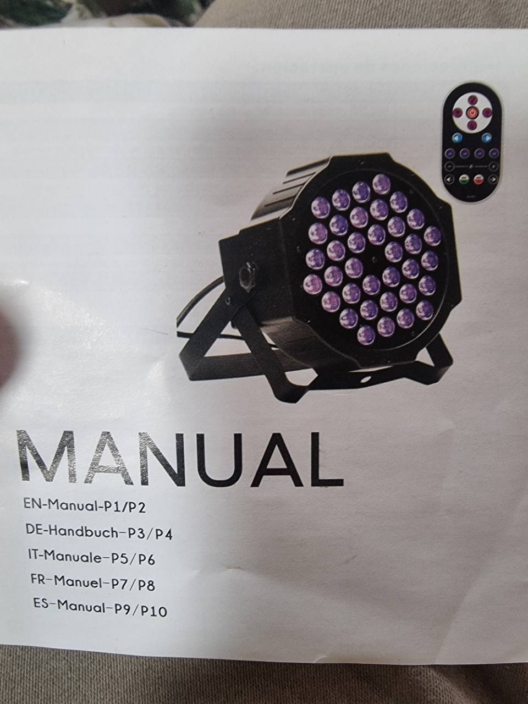
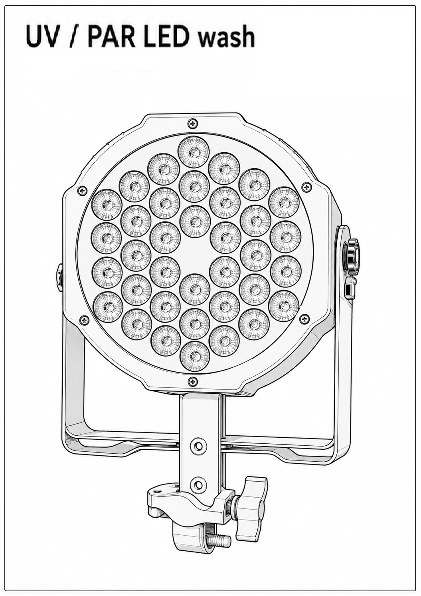

# AB-FIX-004: UV DMX LED Par

## Identification

- Type: UV/purple LED par wash
- Category: UV / LED par wash
- Manufacturer: Generic
- ArtBastard profile ID: `uv-dmx-led-par`

## 7-channel DMX Mode

| CH | Name | DMX values | English function |
| --- | --- | --- | --- |
| 1 | Master UV brightness | 0-255 | Master intensity used with CH2-CH4 |
| 2 | UV bank 1 | 0 / 1-255 | Off / dark-to-bright |
| 3 | UV bank 2 | 0 / 1-255 | Off / dark-to-bright |
| 4 | UV bank 3 | 0 / 1-255 | Off / dark-to-bright |
| 5 | Strobe | 0-7 / 8-255 | No strobe / strobe slow-to-fast |
| 6 | Program mode | 0-10 / 11-60 / 61-110 / 111-160 / 161-210 / 211-255 | Manual / colour select / shade / pulse transform / transition / sound active |
| 7 | Program selector/speed | 0-255 | Colour selection or speed for CH6 programs |

## Local Menu

- `D001-D512`: DMX address.
- `CC01-CC64`: colour selection.
- `RB01-RB16`: colour shade speed.
- `PL01-PL16`: colour pulse transform speed.
- `SD01-SD16`: colour transition speed.
- `FL01-FL16`: colour strobe flash speed.
- `Sound`: sound-control mode.
- `R/G/B000-B255`: manual purple/UV brightness controls.

